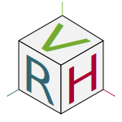

<h2> Hey there! I'm Raphael.</h2>

<h3> 👨🏻‍💻 &nbsp;About Me </h3>

  
  
  
  

- 🤔 &nbsp; I am interested in creating reliable infrastructure for RL/ML. From ETL data pipelines to model serving
- 💼 &nbsp; I am currently working as a Software Engineer at Tempus Ex Machina.
- 🌱 &nbsp; I am currently making a [TagPro](https://tagpro.koalabeast.com/) like simulation environment in Rust for RL Research. More information soon!
- 🔭 &nbsp; I am currently making a Real-time, Graph-based parallelism engine in Rust to help with my TagPro sim environement. More information soon!

 
 

<a href="https://www.linkedin.com/in/raphael-van-hoffelen-ba6393137/">
  
  &thinsp;
</a>
<a href="https://github.com/dskart">
  
  &thinsp;
</a>

